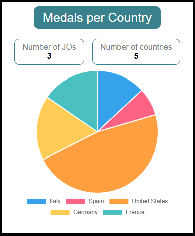

# TELESPORT Olympic Dashboard

This is an interactive web page that provides users with a dashboard allowing them to view information from previous Olympic Games (number of medals per country, etc.).

This project was generated with [Angular CLI](https://github.com/angular/angular-cli) v20.2.1. 

## Features

Home page :\
\
Home page (mouse over the pie chart) :\
\
After click on a slice of the pie chart :\
\
In case of a not valid country name entered in the address bar (country without olympic data) :\
\
In case of bad address entered in the address bar :\
\
In case of 404 error :\

## Technologies and tools
- TypeScript
- SCSS 
- Angular
- chart.js v4.5.0
- ng2-charts v8.0.0

Don't forget to install your node_modules before starting (`npm install`).

## Development server

Run `ng serve` for a dev server. Navigate to `http://localhost:4200/`. The application will automatically reload if you change any of the source files.\
In case of the folowing error :\
[ERROR] TS2307: Cannot find module 'chart.js/dist/types/utils' or its corresponding type declarations.\
Open the file "node_modules/ng2-charts/lib/ng-charts.provider.d.ts", and replace the line:\
import { DeepPartial } from 'chart.js/dist/types/utils';\
By\
import { DeepPartial } from 'node_modules/chart.js/dist/types/utils';\
Then you can rerun `ng serve`.

## Build

Run `ng build` to build the project. The build artifacts will be stored in the `dist/` directory.

## Architecture

The architecture includes (in addition to the default angular architecture) the following:

- `components` folder: contains every reusable components, like those shown in the picture above.   
\
- `pages` folder: contains components used for routing, such as home, details and not-found pages
- `core` folder: contains the business logic (`services` and `models` folders)
- `assets` folder: contains subfolders for images (images) and mock data (mock) used by the application.  

## Author

Julio Daniel
